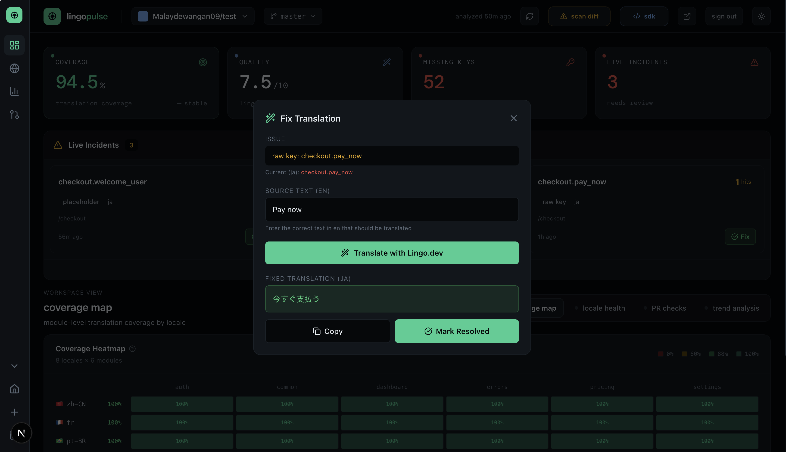

# Lingo Pulse

> Like Datadog, but for translation coverage. Know when Spanish breaks before your users do.

Lingo Pulse is a repo-based i18n monitoring app. Connect a GitHub repository, scan locale files, track coverage by locale/module, and surface translation quality issues before release.

## Quick Start

```bash
npm install
cp .env.example .env.local
# Fill in env variables - see /docs for full setup guide
npm run dev
```

## Features

- GitHub sign-in and repo connection
- Locale file discovery across common repo layouts
- Coverage tracking by locale and module
- Missing key detection
- Translation quality scoring via Lingo.dev
- Scan diff with regression tracking
- Draft fix PR generation
- PR comments and risk checks
- Production incident monitoring (SDK for catching broken translations in production)
- Heatmap visualization for coverage overview
- Locale health breakdown

## SDK - Production Incident Monitoring

Lingo Pulse includes a browser SDK to catch broken translations in production:

- Detects raw keys rendered to users
- Catches placeholder leaks like `{user_name}`
- Reports empty translations
- Captures fallback-locale renders

The SDK reports live incidents back to your dashboard, so you can see exactly what your users are seeing and route directly to a fix PR.

```ts
import { LingoPulse } from '@lingo.dev/_sdk';

const pulse = new LingoPulse({
  repoId: 'your-repo-id',
  ingestKey: 'your-ingest-key',
  appVersion: 'web@1.0.0',
});
```

Full SDK documentation [here](https://lingopulse-lilac.vercel.app/docs#incidentsdk).

## Docs

See **[here](https://lingopulse-lilac.vercel.app/docs)**, for full documentation.

Includes:
- Setup guide
- How analysis works
- Webhook configuration
- SDK integration
- API reference

## Stack

- Next.js 16 + React 19
- Supabase Auth + Postgres
- GitHub OAuth
- Lingo.dev SDK

## Scripts

```bash
npm run dev
npm run build
npm run start
npm run lint
```

## Deploy

Deploy to Vercel, add environment variables, run Supabase migrations, and update Auth redirect URLs.

## Screenshots



