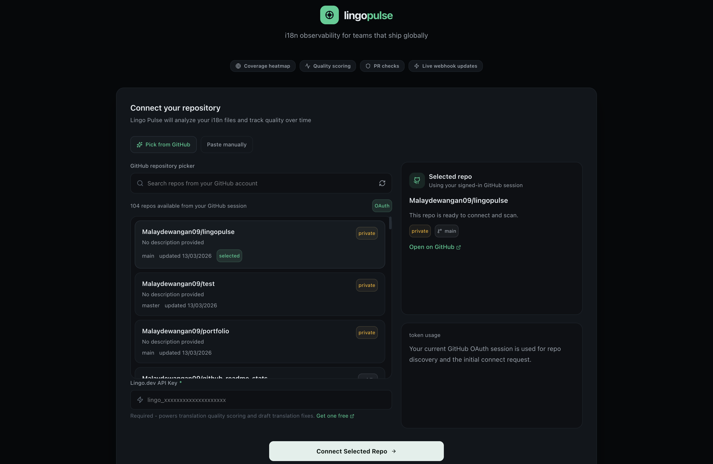

# Lingo Pulse

> Like Datadog, but for your translation coverage. Know when Spanish breaks before your users do.

Lingo Pulse is a repo-based i18n monitoring app. It connects to a GitHub repository, scans locale files, shows coverage by locale and module, and surfaces translation quality issues before release.

## About Lingo.dev

Lingo.dev is used here for translation quality scoring. Coverage tells you whether a key exists. Lingo.dev helps answer the next question: does the translated copy still read well enough to ship.

In this project, Lingo.dev powers the quality scores shown in the dashboard and helps flag strings that need review.

## About This Product

Lingo Pulse adds the workflow around that scoring:

- GitHub sign-in and repo connection
- locale file discovery across common repo layouts
- coverage tracking by locale and module
- missing key detection
- translation quality scoring
- scan diff and draft fix PR generation
- PR comments and PR risk checks
- production incident reporting for broken translations seen by real users

Each signed-in user only sees the repos connected to their own account.

## Stack

- Next.js 16
- React 19
- Supabase Auth + Postgres
- GitHub OAuth
- Lingo.dev SDK

## Local Setup

1. Install dependencies

```bash
npm install
```

2. Copy the example environment file

```bash
cp .env.example .env.local
```

3. Fill in the required environment variables in `.env.local`

- `NEXT_PUBLIC_SUPABASE_URL`
- `NEXT_PUBLIC_SUPABASE_ANON_KEY`
- `SUPABASE_SERVICE_ROLE_KEY`
- `LINGO_DEV_API_KEY`
- `GITHUB_WEBHOOK_SECRET`

4. Run the Supabase migrations in order

- `supabase/migrations/001_initial.sql`
- `supabase/migrations/002_owner_scoping.sql`
- `supabase/migrations/003_pr_checks_repo_pr_unique.sql`
- `supabase/migrations/004_translation_incidents.sql`

5. Configure Supabase Auth

- Enable the GitHub provider in Supabase Auth
- Add redirect URLs for:
  - `http://localhost:3000/auth/callback`
  - your deployed app URL with `/auth/callback`
- In the GitHub OAuth app, use the Supabase callback URL:
  - `https://<your-project-ref>.supabase.co/auth/v1/callback`

6. Start the app

```bash
npm run dev
```

Open `http://localhost:3000`.

## Scripts

```bash
npm run dev
npm run build
npm run start
npm run lint
```

## Notes

- GitHub sign-in is the best path because it unlocks the repo picker flow.
- Lingo.dev scoring depends on `LINGO_API_KEY`.
- If local and production use the same Supabase project, the same signed-in user will see the same repos in both environments.
- Use separate Supabase projects for local, staging, and production if you want full environment isolation.

## Dashboard Views

- `/repo/:id` is the main operational dashboard: coverage, heatmap, locale health, live incidents, and PR checks.
- `/repo/:id/diff` is the focused scan diff and draft-fix view.
- `/repo/:id/sdk` is the production incident SDK setup page with ingest credentials and integration snippets.

## Production Incident Monitoring

Lingo Pulse now supports a small production reporting flow for broken translations:

- raw keys rendered to users
- placeholder leaks like `{user_name}`
- empty translations
- explicit fallback-locale renders

The dashboard stores these as live incidents and can still route you into a draft fix PR.

### How To Use It

1. Open a connected repo in the dashboard.
2. In the `Live Incidents` panel, copy the `repoId` and `ingestKey` shown in the SDK snippet.
3. Add the SDK to the frontend app you want to monitor.
4. Report broken translations with `inspect(...)` or wrap your translator.
5. Set a distinct `appVersion` per app or surface so the incident feed shows which SDK source reported the issue.

### Example

```ts
import { LingoPulse } from '@/lib/sdk/lingopulse';

const pulse = new LingoPulse({
  repoId: 'your-repo-id',
  ingestKey: 'your-public-ingest-key',
  apiBase: 'https://your-lingopulse-app.vercel.app',
  appVersion: 'web@1.4.2',
});

const t = pulse.wrapTranslator(i18n.t.bind(i18n), (key: string) => ({
  locale: i18n.language,
  route: window.location.pathname,
  translationKey: key,
}));
```

Or call `inspect` directly:

```ts
const label = pulse.inspect(i18n.t('checkout.pay_now'), {
  locale: i18n.language,
  route: window.location.pathname,
  translationKey: 'checkout.pay_now',
});
```

Plain HTML / JS apps can use the browser build too:

```html
<script src="https://your-lingopulse-app.vercel.app/lingopulse-browser.js"></script>
<script>
  const pulse = new window.LingoPulse({
    repoId: 'your-repo-id',
    ingestKey: 'your-public-ingest-key',
    apiBase: 'https://your-lingopulse-app.vercel.app',
  });

  pulse.inspect('checkout.pay_now', {
    locale: 'ja',
    route: '/checkout',
    translationKey: 'checkout.pay_now',
  });
</script>
```

If more than one app reports into the same repo, use different `appVersion` values such as:

- `web@1.4.2`
- `marketing@2026-03-13`
- `checkout-widget@2.1.0`

Lingo Pulse uses that value as the incident source label in the dashboard.

The ingest endpoint is:

```txt
POST /api/incidents/report
```

This endpoint expects:

- `repoId`
- `ingestKey`
- `issueType`
- `locale`

The route supports cross-origin browser calls so you can post incidents from an app hosted elsewhere.

## Deploy

Deploy to Vercel, add the same environment variables, run the Supabase migrations on the target database, and update Supabase Auth redirect URLs for the deployed domain.


## Screenshots



