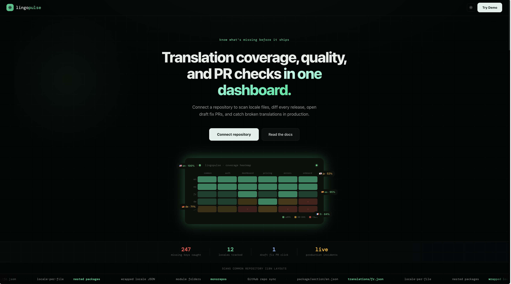
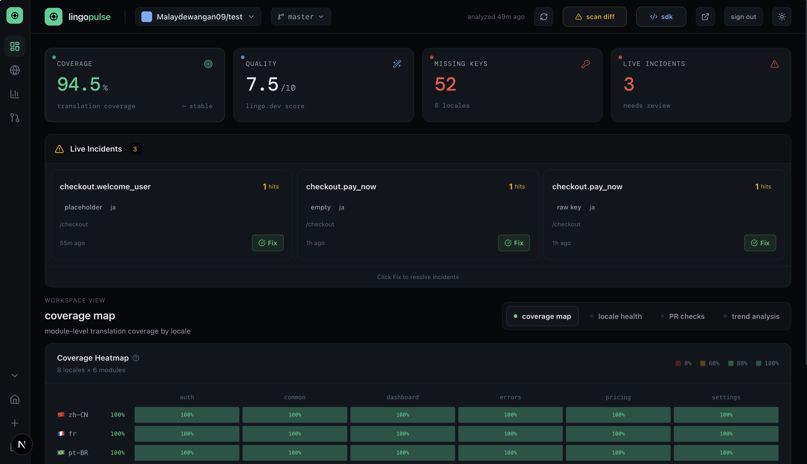
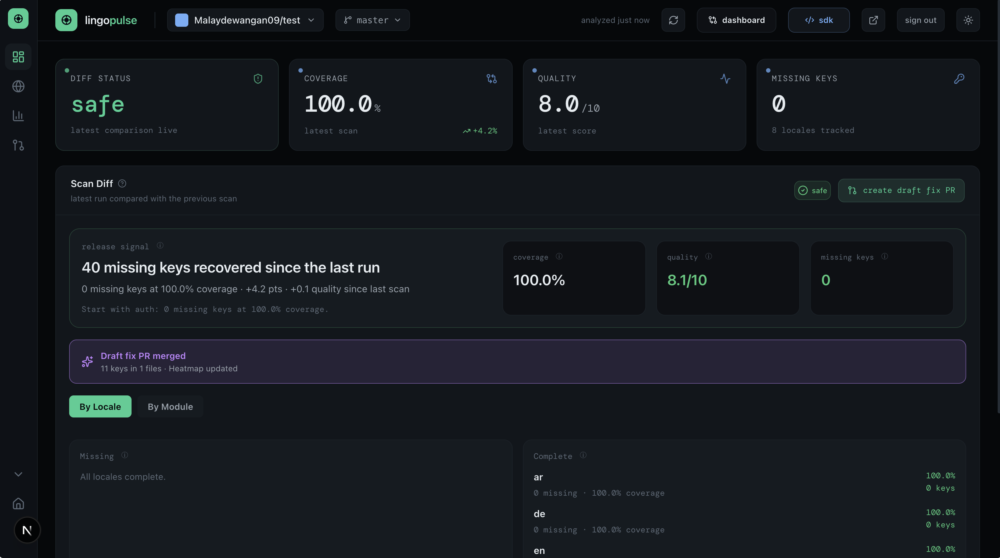
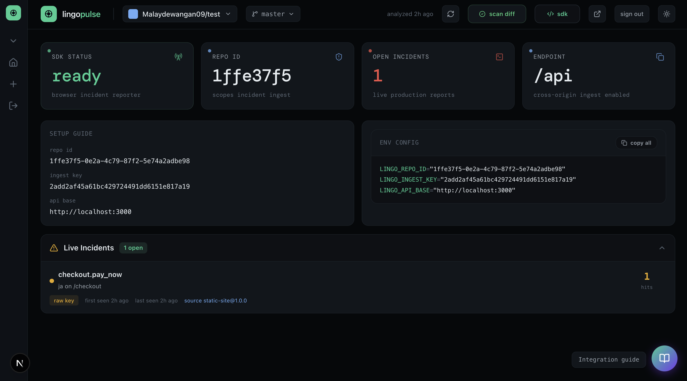

# Lingo Pulse

> Like Datadog, but for translation coverage.

Most i18n bugs are found by users, not developers. A string goes missing, a raw key leaks, a placeholder renders as `{user_name}` — and you find out from a support ticket.

Lingo Pulse connects to your GitHub repo, scans your locale files on every push, and tells you what broke before it ships.

---

## What it does

**Scan** — connect a repo and Lingo Pulse maps your locale files automatically. No config files, no custom setup. It finds missing keys, tracks coverage per locale and module, and scores translation quality.

**Diff** — every push generates a scan diff. You can see exactly what regressed, what recovered, and open a draft fix PR in one click.

**Monitor** — drop the SDK in your frontend and catch broken translations from real users in production. Raw keys, empty strings, placeholder leaks — all reported back to your dashboard live.

---

## Quick start

```bash
npm install
cp .env.example .env.local
npm run dev
```

You'll need:
- A GitHub OAuth app (client ID + secret)
- A Supabase project (URL + anon key)
- A Lingo.dev API key for quality scoring

Full setup guide in the [docs](https://lingopulse-lilac.vercel.app/docs).

---

## SDK

Drop this in your frontend to catch broken translations in production:

```ts
import { LingoPulse } from '@lingo.dev/_sdk';

const pulse = new LingoPulse({
  repoId: 'your-repo-id',
  ingestKey: 'your-ingest-key',
  appVersion: 'web@1.0.0',
});
```

It detects raw keys (`checkout.pay_now`), placeholder leaks (`{user_name}`), empty translations, and fallback-locale renders — then sends them to your dashboard.

Full SDK documentation in the [docs](https://lingopulse-lilac.vercel.app/docs#incidentsdk).

---

## Stack

- Next.js + React
- Supabase (auth + database)
- GitHub OAuth
- Lingo.dev (quality scoring)

---

## Deploy

Vercel works out of the box. Add your env variables, run Supabase migrations, and update the GitHub OAuth callback URL to your production domain.

---

## Screenshots





